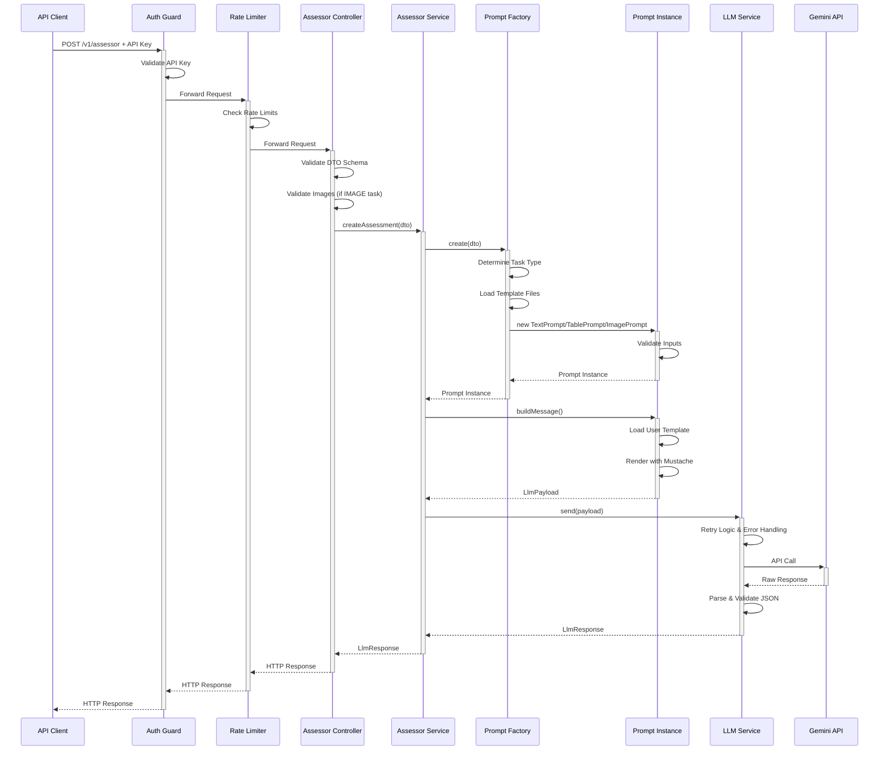
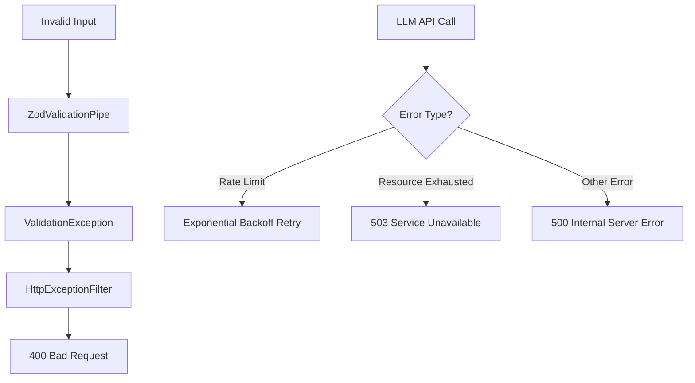

# Data Flow

Request/response flow from HTTP request to LLM response.

## Flow Steps

### 1. Request Entry

`POST /v1/assessor` — received by NestJS, processed through middleware with logging and data redaction.

### 2. Security Layer

- **Authentication**: `ApiKeyGuard` validates Bearer token from `Authorization` header; rejects with 401 if invalid.
- **Rate Limiting**: `ThrottlerGuard` enforces per-time-window limits; returns 429 if exceeded.

### 3. Controller Layer

`AssessorController` validates the request body via `ZodValidationPipe` against `createAssessorDtoSchema`, performing task-type-specific checks (e.g. image format and size for `IMAGE` tasks).

### 4. Service Layer

`AssessorService.createAssessment()` orchestrates the workflow: delegates prompt creation to `PromptFactory`, triggers message building, and sends the payload to the LLM.

### 5. Prompt Generation

`PromptFactory` instantiates the correct prompt type (Text, Table, or Image) based on task type. The prompt validates inputs, loads Markdown templates, and renders them with Mustache using assessment variables (`{{referenceTask}}`, `{{studentTask}}`, `{{emptyTask}}`).

### 6. LLM Integration

`LLMService.send()` applies exponential backoff retry on rate limits (up to `LLM_MAX_RETRIES` times), calls the Gemini API via `GeminiService`, parses the response JSON (repairing with `jsonrepair` if needed), and validates against `LlmResponseSchema`.

### 7. Response Delivery

Validated `LlmResponse` is returned as HTTP 200 JSON. Error responses use appropriate HTTP codes: 400 (validation), 401 (auth), 429 (rate limit), 500 (LLM failures), 503 (resource exhausted).

## Error Handling Flow

---

_For architectural context, see [Architecture Overview](overview.md) and [Module Responsibilities](modules.md)._
