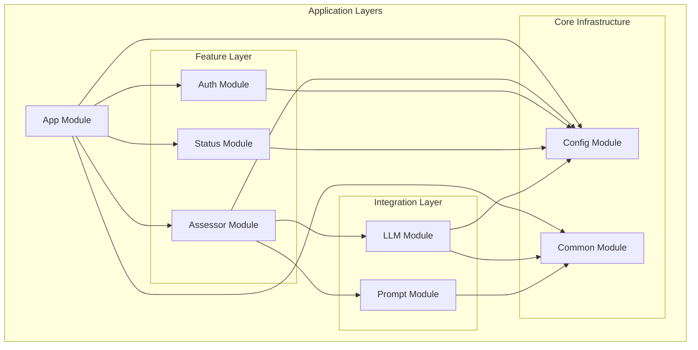

# Module Responsibilities

Brief overview of each module's responsibility and dependencies.

## Core Modules

### App Module (`src/app.module.ts`)

Root module that composes all feature and infrastructure modules. Configures global logging (`nestjs-pino`), rate limiting (`ThrottlerModule`), and wires all dependencies.

### Config Module (`src/config/config.module.ts`)

Centralised configuration management. Loads environment variables and validates them against Zod schemas. Uses the Adapter pattern to wrap NestJS's `ConfigModule`, exporting only the custom `ConfigService`.

### Common Module (`src/common/common.module.ts`)

Shared utilities: `JsonParserUtility` (injectable), plus standalone utilities `ZodValidationPipe`, `ImageValidationPipe`, `HttpExceptionFilter`, file utilities (`file-utilities.ts`), `LogRedactor`, type guards, and `crypto.utilities`.

## Feature Modules

### Assessor Module (`src/v1/assessor/assessor.module.ts`)

Core assessment API (v1). Exposes `POST /v1/assessor` via `AssessorController`, orchestrates assessment workflow via `AssessorService`. Depends on `ConfigModule`, `LlmModule`, `PromptModule`.

### Auth Module (`src/auth/auth.module.ts`)

API key authentication with Bearer tokens. Provides `ApiKeyStrategy` (Passport), `ApiKeyGuard`, and `ApiKeyService`. Stateless — validates keys against environment configuration.

### Status Module (`src/status/status.module.ts`)

Health check and diagnostics endpoints. Provides `StatusController` and `StatusService`.

## Integration Modules

### LLM Module (`src/llm/llm.module.ts`)

Abstracts LLM provider interaction. Defines `LLMService` abstract base class with common retry logic, and provides `GeminiService` as the concrete implementation for Google Gemini. Uses Strategy + Provider patterns.

### Prompt Module (`src/prompt/prompt.module.ts`)

Task-specific prompt generation. `PromptFactory` (Factory pattern) creates `TextPrompt`, `TablePrompt`, or `ImagePrompt` instances inheriting from the `Prompt` base class (Template Method pattern). Uses Mustache for template rendering.

## Module Dependency Graph

## Cross-Cutting Concerns

- **Logging**: `nestjs-pino` configured at App Module level — structured JSON in production, pretty-printed in development. Sensitive data redaction applied to all request logs.
- **Validation**: Zod schemas throughout — DTO validation in controllers, env vars in Config Module, LLM responses in LLM Module. Custom `ZodValidationPipe` in Common Module.
- **Error Handling**: Global `HttpExceptionFilter` in Common Module maps all exceptions to structured HTTP error responses.
- **Rate Limiting**: Global throttling configured in App Module with endpoint-specific overrides. Authenticated routes have custom limits.

---

_For detailed class relationships, see the [Class Structure](../design/ClassStructure.md) diagram._
