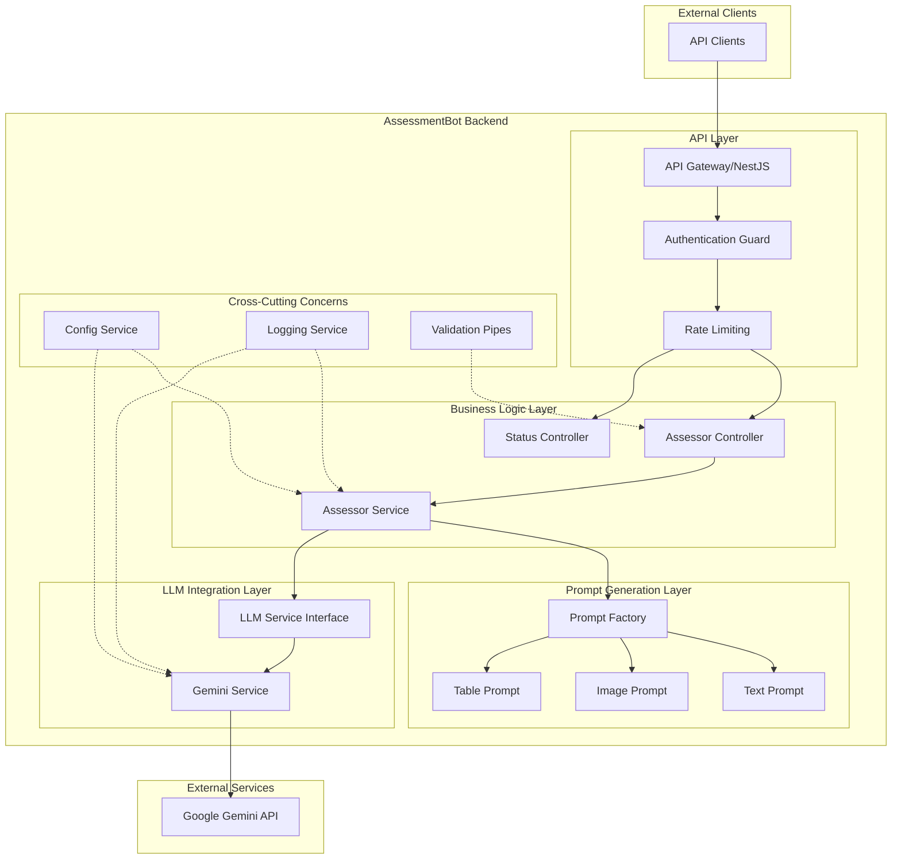
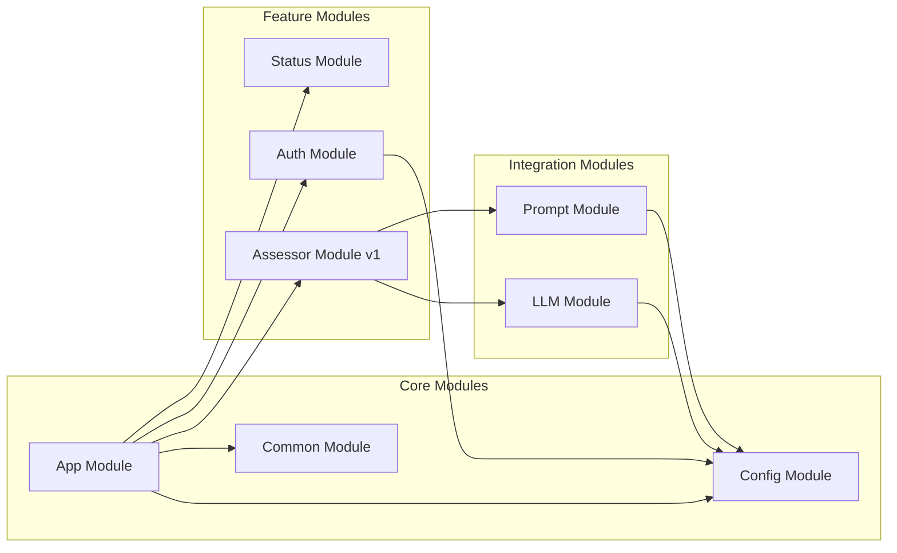

# Architecture Overview

High-level architecture of the Assessment Bot LLM Service, a NestJS-based API that uses LLMs for automated educational assessment.

## High-Level Architecture

### Key Components

| Component                | Responsibility                                          |
| ------------------------ | ------------------------------------------------------- |
| **Authentication Guard** | API key validation via Bearer tokens                    |
| **Rate Limiting**        | Request throttling for abuse prevention                 |
| **Assessor Service**     | Core business logic orchestration                       |
| **Prompt Factory**       | Task-specific prompt generation (Factory pattern)       |
| **LLM Service**          | Abstract interface for LLM providers (Strategy pattern) |
| **Gemini Service**       | Google Gemini API integration                           |
| **Config Service**       | Zod-validated environment configuration                 |

## External Dependencies

- **Google Gemini API**: Primary LLM provider for content assessment

## Module Architecture

## Technology Stack

- **Runtime**: Node.js 22 (Debian dev container / `node:22-alpine` production)
- **Framework**: NestJS with Express.js, TypeScript
- **Validation**: Zod schemas for all runtime validation
- **Auth**: Passport.js with `passport-http-bearer` strategy
- **LLM Integration**: Abstract `LLMService` base class, `GeminiService` implementation, `jsonrepair` for response parsing
- **Templating**: Mustache for prompt rendering
- **Testing**: Vitest, Supertest
- **Logging**: `nestjs-pino` with structured JSON output
- **Rate Limiting**: `@nestjs/throttler`

### Environment Differences

- **Production** (`node:22-alpine`): Minimal Alpine Linux image for smaller, more secure containers.
- **Development** (Debian-based): Full feature set with debugging tools and utilities. Always test production builds against `node:22-alpine` to ensure compatibility.

---

_For detailed module responsibilities, see [Module Responsibilities](modules.md). For class relationships, see the [Class Structure](../design/ClassStructure.md) diagram._
