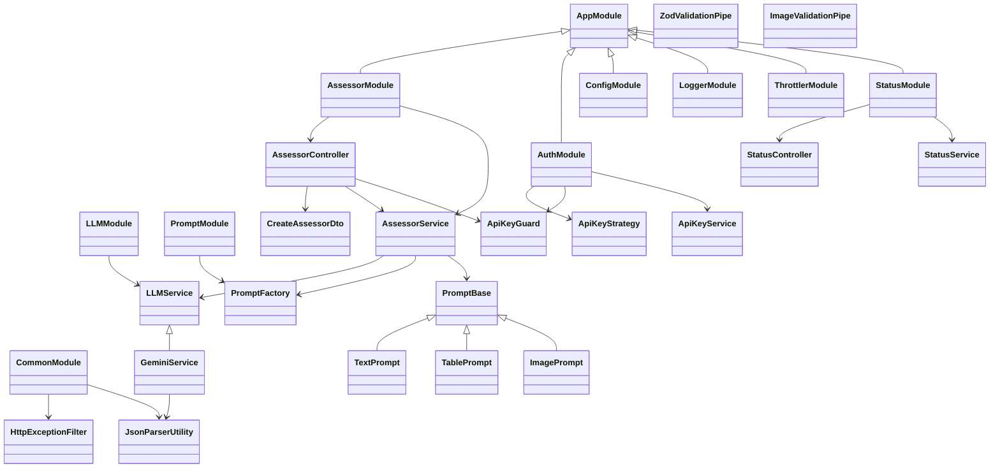

```mermaid
classDiagram
    %% Root Application Module
    class AppModule

    %% Feature Modules
    class AssessorModule
    class AuthModule
    class ConfigModule
    class LoggerModule
    class ThrottlerModule
    class CommonModule
    class LLMModule
    class PromptModule
    class StatusModule

    %% Assessor Components
    class AssessorController
    class AssessorService
    class CreateAssessorDto

    %% Status Components
    class StatusController
    class StatusService

    %% Auth Components
    class ApiKeyStrategy
    class ApiKeyGuard
    class ApiKeyService

    %% Common Utilities
    class HttpExceptionFilter
    class ZodValidationPipe
    class JsonParserUtility
    class ImageValidationPipe

    %% Prompt Hierarchy
    class PromptBase
    class TextPrompt
    class TablePrompt
    class ImagePrompt
    class PromptFactory

    %% LLM Service Hierarchy
    class LLMService
    class GeminiService

    %% Module Relationships
    AppModule <|-- AssessorModule
    AppModule <|-- AuthModule
    AppModule <|-- ConfigModule
    AppModule <|-- LoggerModule
    AppModule <|-- ThrottlerModule
    AppModule <|-- StatusModule

    %% Assessor Relationships
    AssessorModule --> AssessorController
    AssessorModule --> AssessorService
    AssessorController --> CreateAssessorDto
    AssessorController --> AssessorService

    %% Status Relationships
    StatusModule --> StatusController
    StatusModule --> StatusService

    %% Auth Relationships
    AuthModule --> ApiKeyStrategy
    AuthModule --> ApiKeyGuard
    AuthModule --> ApiKeyService

    %% Common Module Relationships
    CommonModule --> HttpExceptionFilter
    CommonModule --> JsonParserUtility

    %% Prompt Module Relationships
    PromptModule --> PromptFactory

    %% LLM Module Relationships
    LLMModule --> LLMService

    %% Prompt Inheritance
    PromptBase <|-- TextPrompt
    PromptBase <|-- TablePrompt
    PromptBase <|-- ImagePrompt

    %% LLM Service Inheritance
    LLMService <|-- GeminiService

    %% Service Integration
    AssessorService --> LLMService
    GeminiService --> JsonParserUtility
    AssessorService --> PromptFactory

    %% Usage Relationships
    AssessorController --> ApiKeyGuard
    AssessorService --> PromptBase
```
